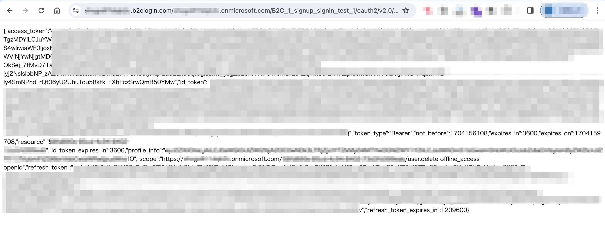
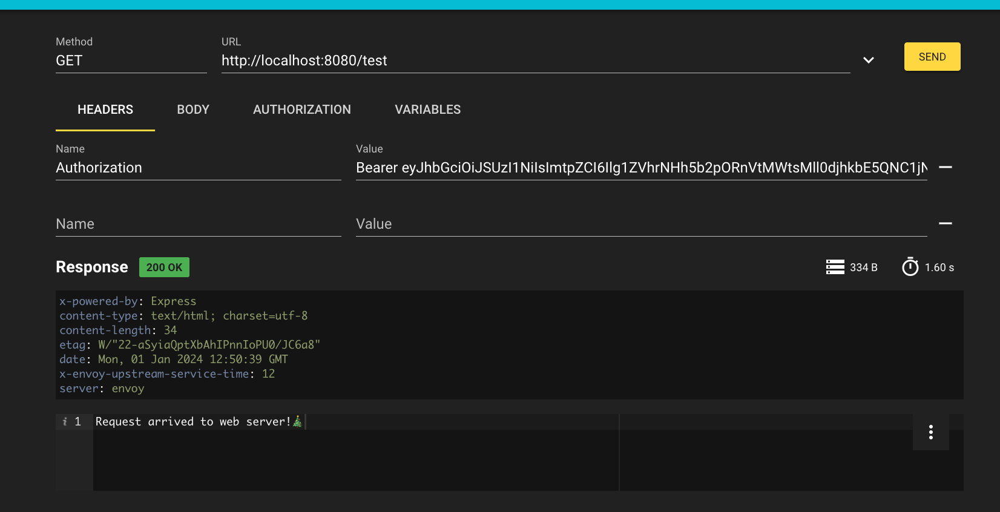

# AAD B2C - Envoy JWT Authentication
Azure AD B2C の認証機能を用いて、Envoy Proxy の JWT Authentication 機能を検証するための環境構築用レポジトリ

1. 下記の記事に従い、Azure AD B2C 側の準備を行います
- https://zenn.dev/hebo4096/articles/3848e1d1eebaba

2. .env ファイルへ Envoy Proxy / Node App の設定に必要となる環境変数を代入します

.env ファイルの中身(例)
```
# [Must] Envoy Proxy and Node App Configs
AADB2C_HOST=yourtenant.b2clogin.com
AADB2C_APPLICATION_CLIENT_ID=00000000-0000-0000-0000-000000001000
AADB2C_APPLICATION_CLIENT_SECRET=suY8Q~XXXXXX.XXXXXXXXXXXXXXXXXAx

# [Must] Envoy Proxy Configs
HMAC_GENERIC_SECRET=vroivoerbobgoebgeio
ENVOY_LISTENER_PORT=8080
ENVOY_SIGNIN_PORT=8081
ENVOY_DEBUG_LEVEL=debug
AADB2C_TOKEN_ISSUER=https://yourtenant.b2clogin.com/00000000-0000-0000-0000-000000002000/v2.0/
AADB2C_JWKS_ENDPOINT_URI=https://yourtenant.b2clogin.com/yourtenant.onmicrosoft.com/discovery/v2.0/keys?p=b2c_1_signup_signin_test_1
AADB2C_TOKEN_ENDPOINT_URI=https://yourtenant.b2clogin.com/yourtenant.onmicrosoft.com/oauth2/v2.0/token?p=b2c_1_signup_signin_test_1
AADB2C_AUTHORIZE_ENDPOINT_URI=https://yourtenant.b2clogin.com/yourtenant.onmicrosoft.com/oauth2/v2.0/authorize?p=b2c_1_signup_signin_test_1
AADB2C_CALLBACK_URL=http://localhost:3000/callback

# [Must] Node App Configs
AADB2C_TENANT=yourtenant.onmicrosoft.com
AADB2C_USERFLOW_POLICY=B2C_1_signup_signin_test_1

# [Optional] Set the API Scope if you need access token from Azure AD B2C
AADB2C_API_SCOPE=https://yourtenant.onmicrosoft.com/00000000-0000-0000-0000-000000003000/user.delete

```
※ AADB2C_API_SCOPE を指定しなかった場合、アクセス トークンが払い出されず、ID トークンのみが払い出されます。
(注) JWT Authentication フィルターではトークンの有効性 (JWT 形式であるか、署名が正しいか等) を検証してくれます。厳密には ID トークンを Bearer ヘッダ指定した場合であっても、トークンの有効性を確認できるため、JWT Authentication フィルターの検証に成功します。

※ HMAC_GENERIC_SECRET には文字列を適当に作成して代入していただければ大丈夫です

3. docker compose にてローカル環境に検証環境を立ち上げます

```
docker compose up
```

4. 下記エンドポイントへアクセスし、アクセス トークンを取得します。
```
http://localhost:8081
```



5. 4. で取得したアクセス トークンを Bearer ヘッダーにて指定し、下記エンドポイントへアクセスした際に正常な応答が返ってくることを確認します。
```
http://localhost:8080/test
```


